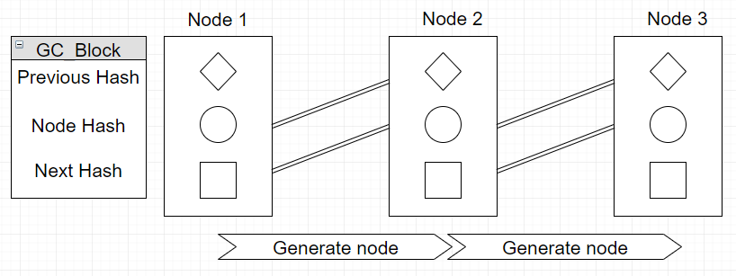
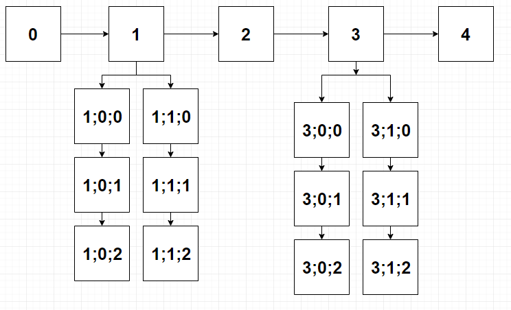

# Branching-Blockchain
This repo contians networking and cryptographic modules. Please read the source code in the chain directory as it will always have the latest documentation written alongside the code. 

## Dependencies
#### Python3.6 https://www.python.org/
#### go-ipfs https://github.com/ipfs/go-ipfs
#### py-ipfs-api https://github.com/ipfs/py-ipfs-api
#### requests https://github.com/requests/requests

## Indexable Branching Blockchain Network
A branching blockchain network allows for the creation of “branched” chains separate from the “genesis chain”. Users of the network access it by becoming a node on the network. They launch and interact with the node through a client interface. 
### Genesis Chain
The genesis chain is the backbone of the network. The chain is made up of node blocks. The nodes represent users or computers connected to the network. Each block contains three hashes: the previous, current and next. The current hash is the unique hash given to every new node added to the network.  When a new genesis chain block is generated it takes the next hash from the last block in the chain and generates the hash of the next block. This groups calculations together to ensure security and reduces future processes. The chain is a digital ledger that every node on the network has a copy of. This ledger contains block hashes in a multi-dimensional array. The multi-dimensional array gives the network its indexable abilities. 
### Branched Chains
Branched chains contain a genesis block identical the block in the genesis chain they are linked to. This facilitates the generation of a new chain effectively and establishes ownership over the generated chain. Branched chains use hash addresses of a variable length depending on the development needs. The default configuration of a branched chain block contains two hash addresses: the previous and current addresses. The node hash is combined with the branch hash and transaction hash to form the current address hash sequence. 
### Structure 
The genesis chain runs horizontally and the subsequent branched chains run . The numbers represent simple index values, in an applicational sense those would be replaced with hashes and binary numbers. Branched chains have an inherent value based on the amount of validated work they contain. This value is stored in the address hash. 

### Implementation of a branching block chain into the ICS
#### Genesis chain: User chain
The genesis chain will contain a two-way communicable list of nodes on the network. Each block in the chain will contain three separate hashes. The first hash is the node hash of the previous block. The second hash has already been calculated in the previous block and is the personal hash of the newest user being generated. 
#### Branched chains: Idea chains
The branched chains contain information relevant to idea value and IPFS storage addresses. The blocks themselves have a previous block hash and a current hash. This makes chains immutable in a sense that to edit a block halfway up the chain would require the network to recalculate and rewrite the chain. Unless a network consensus to carry out this work is reached the chain stays the same.  The genesis block of the branched chain is identical to the node block it was created from. This establishes ownership over the chain by a single user. The hash used for the idea chains are different than a regular SHA256 in the fact that they are multidimensional arrays containing hashes in the layout described in Figure 2.The hash index format is laid out above. Each block on the idea chain has an idea_hash and contains the previous idea_hash to form a one-way list unlike the genesis chain which can be read in two directions. The idea chain only travels one direction allowing for value calculations to remain unchanged and giving the developer the ability to calculate the value of the idea over time whether it rises or falls. 

## Modules
### Chain
#### 
#### 
#### 
#### 
#### 
#### 
#### 
#### 
#### 